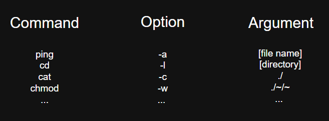

# Command Structure

A Linux command can usually be divided into three main parts: a command, options, and arguments.

## Command

A command is an instruction that tells a computer to perform a specific action.

Additionally, many commands are executable programs, while others are built into the shell. Executing a command tells the shell or operating system to perform a specific action.

Example: ping -c 3 192.212.142.32 (The relevant part is highlighted in red.)

## Options

An option is usually not required to run a command, but it modifies how the command behaves.

For example, if we run `ping` without an option, it continues sending packets until we stop it manually.

However, if we add `-c 3`, `ping` sends 3 packets and then stops automatically.

Some short options can be combined. 

For example, `ls -a -l` can often be written as `ls -al`.

In many Linux commands, options are placed after the command and before the arguments.

For example, `ls -al ./`

Example: ping -c 3 192.212.142.32

## Arguments

Arguments specify the target of a command or provide additional information about what the command should operate on.

Some commands can be run without arguments, while others require additional information.

For example, if we run `ls` without an argument, it lists the contents of the current directory.

However, if we specify the location with an argument like `ls ./test/`, it lists the contents of the `test` directory.

Example: ping -c 3 192.212.142.32

### Example command breakdown

- `ping` → command
- `-c`→ option
- `3` → value for the `-c` option
- `192.212.142.32` → argument / target

