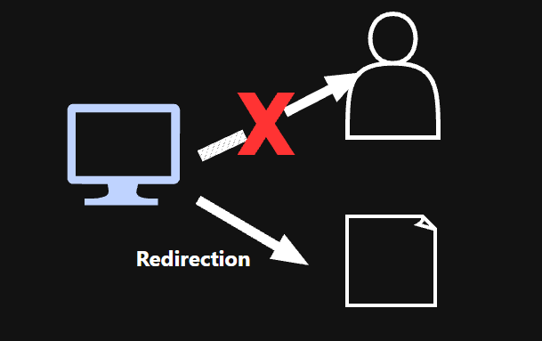

# Redirection

>> Redirection changes where an input or output stream is sent.

When a command produces output through stdout, it is usually displayed in the terminal. However, if we redirect the output, we can store the result directly in a file.

#### Redirection Syntax

`[command] [optional FD]> [file path or file name]`

*If the FD is omitted, stdout (FD 1) is redirected by default.*

When we redirect output to an existing file using `>`, the existing contents are overwritten.

If we want to append output to an existing file instead of overwriting it, we use `>>`.

Example: `ls >> ./test.txt`

If we redirect stderr to a file, stdout remains in its original destination, which is usually the terminal.

Example: `command 2>error.txt`

#### Additional Information

`/dev/null` is a special device that discards any data written to it.

Example: `command > /dev/null`

`2>&1` means redirect stderr (FD 2) to the same destination as stdout (FD 1).

Example: `command > output.txt 2>&1`
