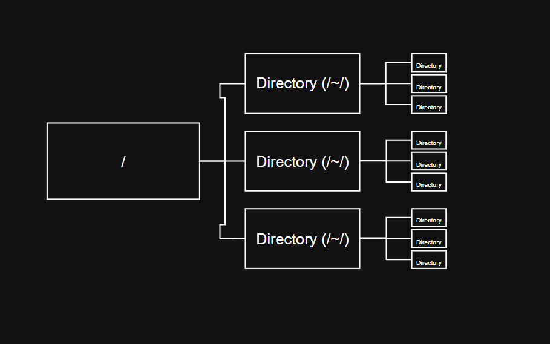

# File System (1)

The Linux file system is organized in a tree structure.

## Tree Structure

In a tree structure, the root directory (`/`) is at the top of the directory hierarchy, and other directories branch out from it like the branches of a tree.

For example, the Desktop folder is also a directory within the Linux file system.

## In Linux

In a Linux terminal, we can often see our current location in the shell prompt. 

For example, a prompt may display the username, machine name, and current directory. 

This is useful because knowing the current working directory is important when working in a command-line environment.