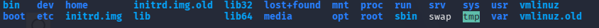

# File System (2)

>> **/bin**: stores essential user command binaries.

>> **/dev**: stores device files that represent hardware and virtual devices.

>> **/etc**: stores system-wide configuration files.

>> **/home**: stores the home directories of regular user accounts.

>> **/lib**: stores essential shared library files used by programs.

Shared libraries in Linux commonly use the `.so` extension. They are similar to DLL files in Windows because programs can load and use functions from shared libraries instead of containing all of the code themselves.

>> **/root**: the home directory of the root account.

>> **/sbin**: stores essential system administration binaries.

>> **/tmp**: stores temporary files.

Most users can use this directory. Files in `/tmp` may be removed automatically, often after a reboot or according to the system's cleanup policy.

>> **/var**: stores variable data that changes while the system is running.

Examples include logs, cache files, mail files, and web server data.

For example, Apache web content is commonly stored in `/var/www`.