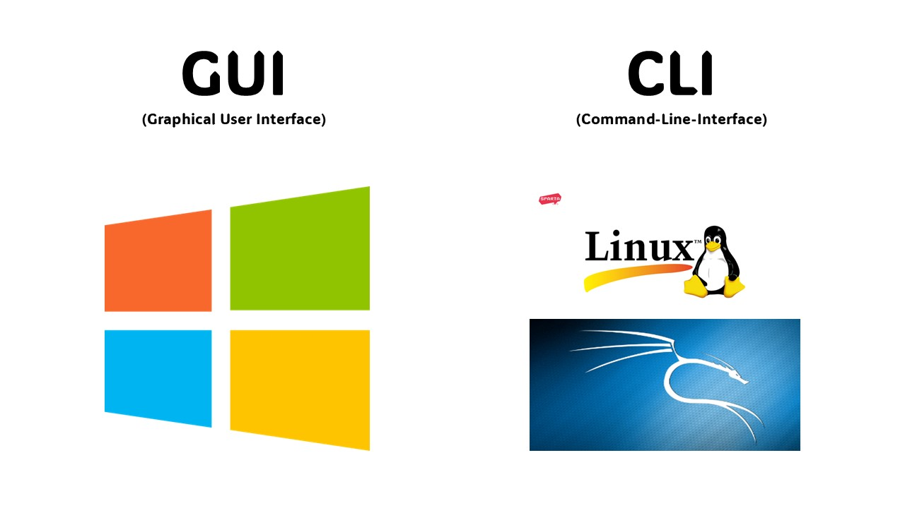

# GUI & CLI

There are two common ways to interact with an operating system: GUI and CLI.

## GUI

GUI stands for Graphical User Interface. It allows users to interact with a computer through visual elements.

Example: Windows desktop environment

- To interact with a GUI, we usually use a mouse and keyboard.

## CLI

CLI stands for Command-Line Interface. It allows users to interact with a computer by entering text-based commands.

Example: Linux Terminal

- Most modern operating systems provide both. For example, Windows provides both a graphical interface and command-line tools such as Command Prompt and PowerShell, and Linux can also be used with graphical desktop environments.

## Linux

#### Why do penetration testers study Linux?

To work effectively with computer systems, penetration testers should understand how operating systems work. 

However, not every computer system is operated through a GUI. 

Penetration testers often work with systems and services through command-line tools rather than relying only on GUIs. 

Additionally, CLI-based tools can often make penetration testing tasks faster and easier to automate. 

Therefore, penetration testers should be comfortable working with Linux.

## Kali Linux

Linux is an open-source operating system kernel, and many Linux distributions are built around it. 

Kali Linux is one of these distributions and is developed and maintained by OffSec, a cybersecurity company. 

Kali Linux includes many pre-installed tools for penetration testing and security research, so it is widely used by penetration testers and cybersecurity professionals.
