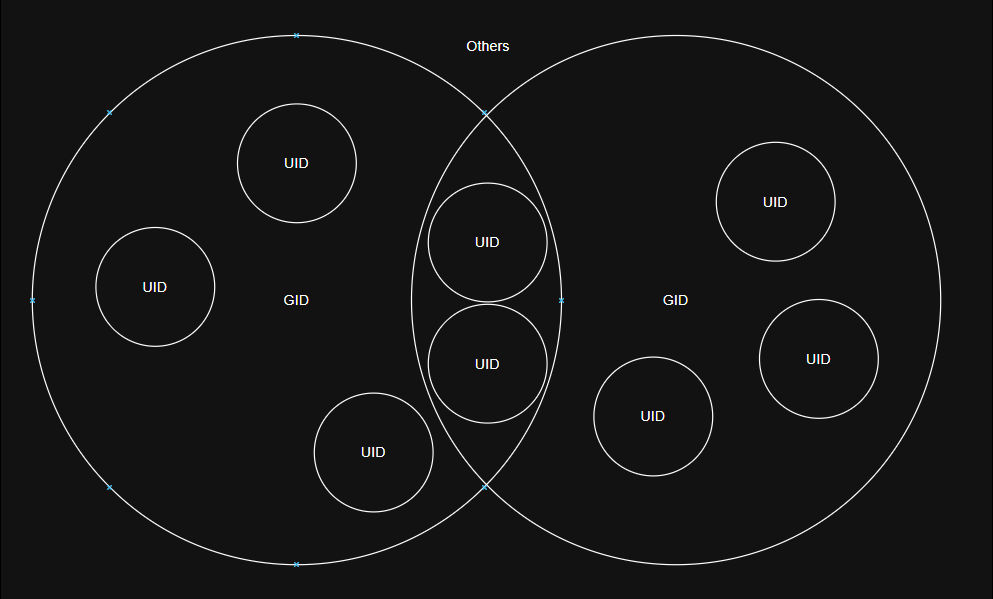

# Linux Permission System

Each account on a computer can have different privileges.

A normal user can access many parts of the file system, but access to protected files, directories, and administrative actions may be denied.

Linux does not primarily identify users by their usernames.

Therefore, even if a normal user changes their username to root, they do not automatically gain root privileges.

Instead of relying only on usernames, Linux identifies users using numeric IDs called UIDs (User IDs).

Additionally, users can be grouped for specific privileges, and groups are also identified by numeric IDs called GIDs (Group IDs).

Example: `uid=0(root) gid=0(root)` (We can see this by running `id` as the root user.)

## Three Basic Permissions

There are three basic permissions for files and directories.

They are:

* R - Read
* W - Write
* X - Execute

#### R

For a file: allows the file to be read.

For a directory: allows the names of files and subdirectories inside the directory to be listed.

#### W

For a file: allows the file to be modified.

For a directory: allows files and subdirectories to be created, deleted, or renamed, usually when execute permission is also present.

#### X

For a file: allows the file to be executed.

For a directory: allows the directory to be entered or traversed.

## File Information

When we check the file information by `ls -l`, we can see the information in such pattern `-rwxrw-r--` or `drwxrw-r--`

We can classify them into '`-` (file type)', '`rwx` (owner permissions)', '`rw-` (group permissions)', '`r--` (others permissions)'.

Each `-` means that the corresponding permission is not granted. If the permission is `rw-`, read and write are allowed, but execute is not.

Additionally, if the file type is a file, the first symbol would be `-` and if the file type is a directory, it would be `d`.

## Special Permissions

There are also 3 types of special permissions in Linux.

### Setuid

Setuid is a special permission on executable files. When the file is executed, the process runs with the effective UID of the file owner.

If setuid is enabled on an executable file, permitted users can run it with the file owner's effective privileges.

In this case, the owner's execute bit `x` is displayed as `s`.

lowercase `s` means setuid is enabled and owner execute permission is also present.

uppercase `S` means setuid is enabled, but owner execute permission is not present.

* setuid enabled + owner execute set: `-rwsrwxrwx`

* setuid enabled + owner execute not set: `-rwSrwxrwx`

### Setgid

For files: a setgid executable runs with the effective GID of the file's group.

For directories, setgid has another important meaning: new files and subdirectories created inside inherit the directory's group.

It is similar to setuid, but it affects the effective group ID instead of the effective user ID.

The group execute bit becomes `s` or `S`.

* setgid + group execute: `-rwsrwsrwx`

* setgid but no group execute: `-rwsrwSrwx`

### Sticky bit

The sticky bit does not grant write permission by itself.

Instead, on a writable shared directory, it restricts who can delete or rename files.

In a sticky directory, files can usually be deleted or renamed only by the file owner, the directory owner, or root.

If the sticky bit is configured and the execute permission for others is present, the `x` changes to `t`.

rwx -> rwt

* sticky bit + others execute: `drwxrwxrwt`

* sticky bit + no others execute: `drwxrwxrwT`

### Extra information

Each permission has a number.

* R - 4
* W - 2
* X - 1

So we can use numeric permission values instead of symbolic permissions in commands such as chmod. ( ex. `chmod 755 file`)

Example:

6 = rw-
3 = -wx
5 = r-x
7 = rwx
