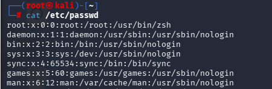

# `passwd` File

The `/etc/passwd` file stores basic information about user accounts.

### Information Format

`[Username]:[Password Field]:[UID]:[GID]:[User Information]:[Home Directory]:[Login Shell]`

Example:

`jun:x:1000:1000:Jun:/home/jun:/bin/bash`

### Fields

- **Username**: the name of the user account.
- **Password Field**: usually contains `x`, which indicates that the password hash is stored in `/etc/shadow`.
- **UID**: User ID.
- **GID**: the ID of the user's primary group.
- **User Information**: additional information about the user, such as the full name.
- **Home Directory**: the user's home directory.
- **Login Shell**: the shell launched when the user logs in.

If the login shell is set to `nologin` or `false`, the account is generally prevented from starting an interactive shell session.

For example:

`/usr/sbin/nologin`

or

`/bin/false`

In Linux, service accounts used by system programs are often configured with `nologin` because they do not normally need interactive login access.

#### Additional Information

*Password hashes for users are stored in `/etc/shadow`.*