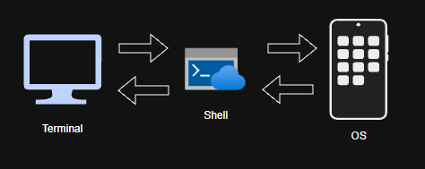

# Terminal and Shell

In the early days of computing, computers were expensive and often shared by multiple users. Each user could access a central computer through a terminal. The concept of interacting with a computer through a terminal still exists today, although modern terminals are usually software-based. When we work with a command-line environment today, we usually interact with a shell through a terminal.

## Terminal

Terminals can be physical devices or software-based terminal emulators. A terminal provides a text-based interface that allows users to interact with a shell or other command-line programs.

Example: Windows Terminal, GNOME Terminal and Konsole

## Shell

A shell interprets user commands and executes them by interacting with the operating system and other programs.

Example: Bash, Zsh and sh
