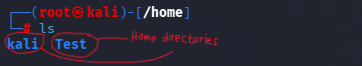

# User

In the early days of computing, a computer was often shared by multiple users through terminals.

Nowadays, we can still see this concept in modern multi-user operating systems.

By separating users into different accounts, the operating system can manage each user's permissions and privileges independently.

Each user usually has their own home directory and personal configuration files.
 
Other users may be restricted from accessing another user's home directory unless they have the required permissions.

